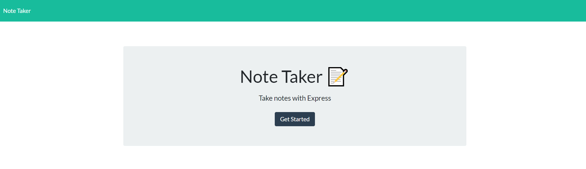
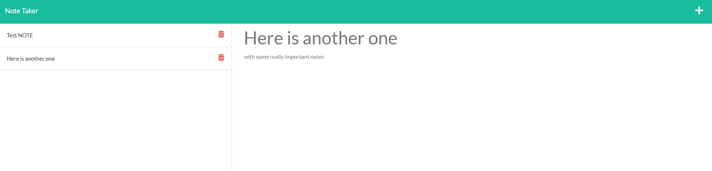

# <ins>Note Taker</ins>


## Description

This app allows you to take notes and have them stored in a JSON object on the server. You can add a title and text to a note, then select the save button, which will send it to the db.json file. It also will store the record in the left side of the page so you can bring it back up or delete it 
## <ins>Table of Contents</ins>
- [Installation](#installation)
- [Usage](#usage)
- [Questions](#questions)

## <ins>Installation</ins>

Be sure to run the following command in a terminal that's opened in the same directory as server.js:
 ```md
 npm install
 ```

## <ins>Usage</ins>
Run the application in the integrated terminal by typing "node server.js". 

Then click on the link that is returned in the terminal to access the server from local host. Alternatively, you can access the app from an [instance that is running on Heroku](https://lit-castle-31184.herokuapp.com/)

Here is what the site looks like!



## <ins>Questions</ins>
Contact the creator of Note Take at lukeajcole@gmail.com. Github link: https://github.com/lukeajcole